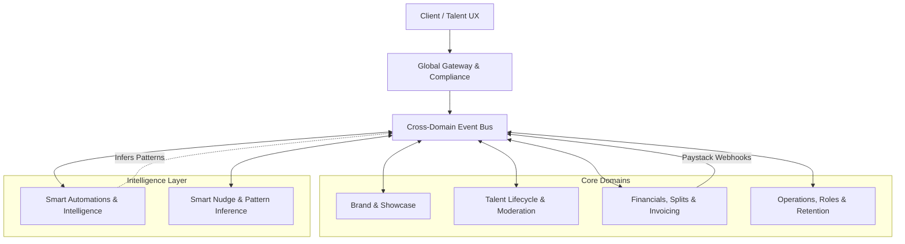

# 11: Master Agency Ecosystem Synthesis

## 1. Macro-Architecture of Case Agency B2B System

The Case Agency Ecosystem operates on a unified event-driven macro-architecture. Domains are decoupled yet highly communicative via a central Cross-Domain Event Bus.

### System Flow
1. **Ingress**: Users interact with the frontend, requests pass through the Global Gateway which enforces compliance, auth, and rate limiting.
2. **Execution**: Core domains handle domain-specific logic (e.g., creating a brand showcase, updating a talent profile, processing an invoice split).
3. **Event Propagation**: All state changes emit events to the Event Bus.
4. **Intelligence Processing**: The Intelligence Layer listens to the event stream, inferring patterns, generating smart nudges, and triggering background automations (e.g., auto-chasing overdue invoices, suggesting talent matches).

## 2. The Harmonized Ecosystem Flywheel

The true power of the Case Ecosystem lies in its interconnectedness. 

*   **Brand & Recruiting Synergy**: An agency's branded showcase automatically updates based on the aggregate skills of the active talent pool. When top talent is recruited and activated, the brand portfolio dynamically highlights their previous case studies (respecting Data Sovereignty).
*   **Financials & AI Nudges**: Financial splits are auto-calculated upon project completion. If a client delays payment, the AI Nudge engine infers the optimal time to send a gentle reminder, escalating intelligently without human intervention.
*   **Data Sovereignty as a Foundation**: Talent retain full ownership of their personal Case profile data. If talent leaves an agency, their core profile goes with them, while the agency retains project-specific anonymized analytics.
*   **Operations & Smart Patterns**: The system observes operational bottlenecks (e.g., delayed approvals) and adjusts routing rules dynamically to ensure a frictionless flywheel.

## 3. Microscopic Edge Case Handling Matrix

| Scenario | Trigger | Automated Handling (System Response) | Fallback / User Intervention |
| :--- | :--- | :--- | :--- |
| **Network Drop during Invoice Generation** | Connection timeout during PDF build | Job queued in background via Event Bus. Retry with exponential backoff (max 5 tries). | Alert generated for Ops team if 5th try fails. |
| **Paystack API Outage** | 5xx response from Paystack | Payment marked as `PENDING_GATEWAY`. Sync cron job scheduled to verify status when API recovers. | User notified: "Payment gateway delayed. Will auto-verify." |
| **Currency Rate Swings** | FX rate shifts > 2% between invoice and payment | System uses locked-in rate at time of invoice creation for splits. Discrepancy logged to Agency Ledger as `FX_VARIANCE`. | Financial Admin receives weekly FX variance report. |
| **Dispute Resolution** | Client flags milestone as `DISPUTED` | Invoice paused. Funds held in escrow. AI generates summary of communication and milestone deliverables. | Human moderator assigned. Nudges sent to both parties. |
| **Talent Departure** | Talent updates status to `UNAVAILABLE_FOR_AGENCY` | Access to internal agency boards revoked. Active projects flagged for reassignment. Data Sovereignty preserved (talent keeps base portfolio). | Ops Manager prompted to approve reassignment of 3 active tasks. |

## 4. Frictionless Agency Operations Guarantee

The system is designed to reduce administrative friction to near zero. This is achieved through:

*   **Zero-Touch Invoicing**: When a milestone is marked complete by both Client and Talent, the invoice is auto-generated, sent, and the payment split is queued. No manual clicks required.
*   **Predictive Talent Matching**: The AI layer analyzes incoming project briefs and cross-references them with talent availability, past performance, and skill taxonomy to suggest the top 3 candidates instantly.
*   **Auto-Drafted Communications**: Routine communications (chasing approvals, status updates) are auto-drafted by the Smart Nudge engine and sent at times optimized for open rates.
*   **Self-Healing Workflows**: If a designated approver is OOO, the pattern inference engine automatically reroutes the approval request to the next available designated peer, ensuring no bottlenecks.
