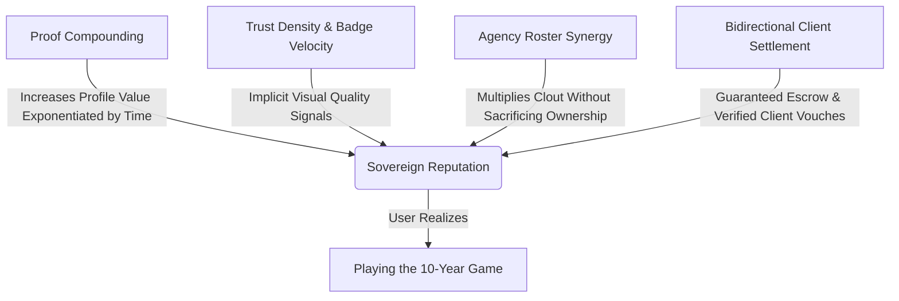

# Case Platform: Implicit Long-Game Retention & Psychological Reinforcement Engine

> **Core Philosophy**: Most professional platforms (LinkedIn, Upwork, Behance) rely on cheap, vanity-driven engagement hooks (likes, connection counts, fake endorsements) that lead to anxiety, spam, and platform churn.  
> **Case operates on Sovereign Proof Compounding**. We design implicit, high-dignity dopamine loops that reward truth, longevity, and quality. Users shouldn't just feel productive—they should feel an overwhelming, implicit confidence that building their Case is the smartest career move of their decade.

---

## 1. The 4 Psychological Levers of the Case Engine



### 1. **Proof Compounding (The Exponential Asset)**
* **The Psychology**: A traditional resume depreciates the day it's written. A Case profile *compounds in value* over time. 10 vouched proof items backed by blockchain/HMAC cryptographic signatures are worth 100x more after 3 years than on day 1.
* **Implicit UI Cue**: Displaying a subtle **"Proof Longevity Weight"** badge on historical items (*"Vouched 3 yrs ago · Unbroken Authenticity Chain"*).

### 2. **Trust Density over Vanity Metrics**
* **The Psychology**: Showing "500+ connections" feels cheap. Showing *"98% Vouch Acceptance Rate across 14 High-Value Projects"* triggers deep professional pride and peace of mind.
* **Implicit UI Cue**: A glowing, high-contrast **Trust Density Bar** that fills as vouches come in from verified peers and client brands.

### 3. **Data Sovereignty & Freedom Protection**
* **The Psychology**: Talent hates feeling locked into an agency or platform. By explicitly reminding talent that their personal profile is 100% independent of any agency, they feel zero hesitation to join agencies.
* **Implicit UI Cue**: A discrete indicator on their dashboard: *"🔒 Sovereign Account Active · 100% Personal Data Ownership Guaranteed"*.

### 4. **Bidirectional Financial Joy**
* **The Psychology**: Receiving money is great; receiving money *transparently with zero split dispute* creates profound professional relief.
* **Implicit UI Cue**: Instant double-entry ledger notifications showing precise split breakdowns: *"Your $1,200 share for project X has settled to your Paystack balance."*

---

## 2. In-App UI Micro-Interactions & Dopamine Touchpoints

### A. **Talent Profile & Dashboard**

| Touchpoint | Micro-Interaction / UI Feature | Implicit Emotional Impact |
|---|---|---|
| **Vouch Received** | When a peer/client approves a vouch, the proof card flashes a subtle emerald glow (`#10b981`) with a soft particle pulse. | *"My work is officially recognized and immutable."* |
| **Completeness Score Increase** | Ring progress bar animates smoothly from 60% → 85% with crisp sound effect (optional) + text: *"Roster Gate Unlocked for Premium Agencies"*. | *"I am qualified for higher-tier opportunities now."* |
| **Agency Invite Received** | A glowing indigo badge appears on their avatar: *"Featured Agency Wants You on Their Roster"*. | *"I am in demand."* |
| **Profile Integrity Badge** | A subtle badge next to their handle: *"Verifiable Career Capital: $XX,XXX"*. | *"My portfolio is a real asset, not just a resume."* |

### B. **Agency OS Dashboard (`/dashboard/agency`)**

| Touchpoint | Micro-Interaction / UI Feature | Implicit Emotional Impact |
|---|---|---|
| **Pitch Viewed by Client** | Real-time live indicator on the pitch card: *"🟢 Client in London is currently viewing Pitch #1042"* (pulses live). | *"The client is engaged right now!"* |
| **Client Booking Inquiry** | A high-contrast alert toast: *"⚡ New $15,000 Inquiry Received via Public Showcase"*. | *"Our agency showcase is actively bringing in business."* |
| **Split Payment Settled** | Financial KPI card counts up dynamically with emerald text animation: *"+$2,400 Agency Revenue Released"*. | *"Management is trivial and automatic."* |
| **Roster Completeness Audit** | Visual health indicator: *"Roster Readiness: 94% · 12/12 Members Battle-Ready"*. | *"My agency operates like a well-oiled machine."* |

### C. **Client Portal & Pitch Checkout (`/pitch/[token]`)**

| Touchpoint | Micro-Interaction / UI Feature | Implicit Emotional Impact |
|---|---|---|
| **1-Click Escrow Lock** | Upon clicking "Accept & Lock Escrow", a celebratory lock graphic appears with: *"🔒 Funds Secured in Escrow · 2-Sided Campaign Created"*. | *"I am completely protected and working with top-tier professionals."* |
| **Brand Verification Badge** | Client profile displays `✓ VERIFIED BRAND` with their calculated **On-Time Payment Rate (100%)**. | *"My company stands out as an employer of choice."* |

---

## 3. High-Signal Notification Engine & Micro-Copy Matrix

Notifications must never feel like spam. Every message must deliver **high economic or reputational signal**.

### Notification Triggers & Micro-Copy Playbook

```json
{
  "notifications": [
    {
      "trigger": "VOUCH_ACCEPTED",
      "channel": ["in_app", "whatsapp"],
      "headline": "Vouch Confirmed ✨",
      "body": "{reviewer_name} just verified your proof for '{proof_title}'. Your Trust Density increased by +5%.",
      "action_label": "View Verified Proof",
      "dopamine_reasoning": "Instant validation of past hard work."
    },
    {
      "trigger": "AGENCY_INVITE_SENT",
      "channel": ["in_app", "whatsapp"],
      "headline": "Agency Roster Invitation 🏛️",
      "body": "{agency_name} has invited you to join their official roster as {role_line}.",
      "action_label": "Review Invitation",
      "dopamine_reasoning": "Validation of professional status."
    },
    {
      "trigger": "PITCH_VIEWED_FIRST_TIME",
      "channel": ["in_app"],
      "headline": "Pitch Opened 👁️",
      "body": "{client_email} is currently viewing the pitch for '{pitch_title}'.",
      "action_label": "Open Pitch Pipeline",
      "dopamine_reasoning": "Real-time deal momentum excitement."
    },
    {
      "trigger": "PAYMENT_SPLIT_SETTLED",
      "channel": ["in_app", "whatsapp"],
      "headline": "Payout Settled 💳",
      "body": "Payment split of {currency} {amount} for '{job_title}' has been credited to your balance.",
      "action_label": "View Ledger",
      "dopamine_reasoning": "Concrete financial reward with zero friction."
    },
    {
      "trigger": "ANNUAL_CAREER_MILESTONE",
      "channel": ["in_app", "email"],
      "headline": "1 Year of Sovereign Proof 🏆",
      "body": "You have built 12 verified proof items and 8 client vouches over the past 365 days. Your profile is in the top 5% of verified talent.",
      "action_label": "Share Career Summary",
      "dopamine_reasoning": "Long-game reinforcement — making them realize Case is their forever career vault."
    }
  ]
}
```

---

## 4. UI Components & Copy Guidelines for Long-Game Retention

### Guideline 1: **Never Use Artificial Scarcity or Pressure**
* ❌ *Don't say*: "Hurry! Upgrade now before your trial expires!"
* ✅ *Do say*: "Your free tier includes up to 4 agency rosters. Upgrade when your agency scales past 10 members."

### Guideline 2: **Highlight Sovereignty at Every Turn**
* ❌ *Don't say*: "You belong to Neon Agency."
* ✅ *Do say*: "You are representing Neon Agency for this project. Your core Case profile remains 100% independent."

### Guideline 3: **Visualize Proof Density & Career Longevity**
* Add a **"Career Capital Timeline"** component to the user dashboard that groups proof items by year (2024, 2025, 2026), showing a visual stack of accumulated verified achievements.

---

## 5. Implementation Plan for Case Core UI

1. **In-App Toast Notification Component**: Build a sleek, dark-mode toast system that renders high-signal events (pitch viewed, vouch accepted, split settled).
2. **Dashboard Longevity & Sovereignty Badges**: Insert subtle visual badges in `AgencyOSDashboard.tsx` and `DashboardClient.tsx`.
3. **Automated WhatsApp Notification Bridge**: Trigger high-signal WhatsApp notifications for milestone events (invites, vouches, payouts).
